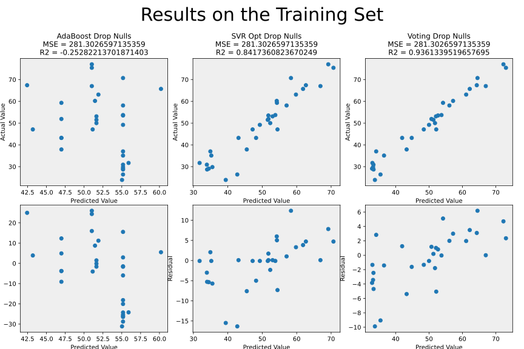
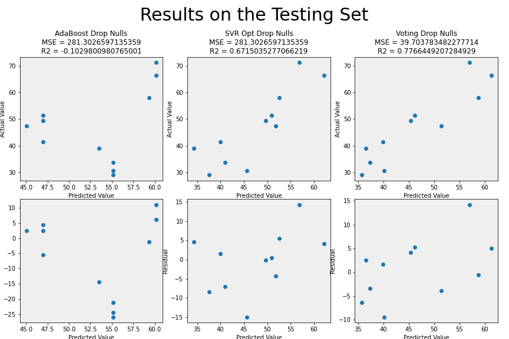

# M11 - Capstone Project for the Dev10 Data Professionals November 2021 Cohort

### Justin Bartell, Abbey Guilliat, Darrell Gerber, and Regina Huber

The capstone project explores how asthma incidence rates relate to environmental factors, specifically focusing on regional air quality and quantifiable measures of local industrial activity. We developed a machine learning model that takes the previous year’s air quality data to predict the yearly number of asthma-induced emergency room visits for any pre-selected county.

Additionally, we explored the correlation between various industries and air quality by considering industry size and revenue outputs as measures of industry activity. A Kafka data stream reads the most recent annual summary data from the EPA air quality API and serves it to a consumer that transforms the data for use as input to the machine learning model. An interactive [Power BI report](Deliverables/PowerBIReport.pbix) is available to run in Power BI on the desktop.

## Folder and File Structure

* Deliverables folder contains required pdf files created during planning ([exploratory questions](Deliverables/ExploratoryQuestions.pdf), [project management plan](Deliverables/ProjectManagementPlan.pdf), [napkin drawings](Deliverables/DashboardNapkinsAndFeedback.pdf)), the [ETL report](Deliverables/RepeatableETLReport.pdf), the [project executive summary](Deliverables/ProjectExecutiveSummary.pdf), and the [presentation slides](Deliverables/CapstonePresentationSlides.pdf). It also includes the original "Project Specifications" folder made during the pre-planning phase of this project.

* Code folder contains all code necessary for the Dashboard, including ETL and ML code.

* Datasets folder contains examples of the original datasets used. Only [asthma emergency department visit data](Datasets/annual_aqi_by_cbsa_2021/annual_aqi_by_cbsa_2021.csv) is used directly from the file stored here. All others, [Census](Datasets/ABSCS2019.AB1900CSA03_2022-01-31T120751/ABSCS2019.AB1900CSA03_data_with_overlays_2022-01-31T120624.csv) and EPA air quality data, are downloaded directly from the cloud using an API when needed.

## Machine Learning

The goal is to predict the rate of emergency room visits based on air quality conditions. Several machine learning algorithms were tested as were combinations of air quality parameters used as predictors and how to handle missing values. All machine learning algorithms used the [scikit learn](https://scikit-learn.org/stable/index.html) Python library version 1.0.2.

* Algorithms
  * [Linear Regression](https://scikit-learn.org/stable/modules/linear_model.html#ordinary-least-squares) - Ordinary Least Squares regression that fits a linear model minimizing the residual sum of squares.
  * [Lasso Regression](https://scikit-learn.org/stable/modules/linear_model.html#lasso) - A linear model that prefers solutions with fewer non-zero coefficients, thus reducing the feature space to the most important features. 
  * [Adaboost](https://scikit-learn.org/stable/modules/ensemble.html#adaboost) - An ensemble method that takes successive weak estimators to reduce the overall bias of the prediction. Adaboost combines estimators iteratively by adjusting weights to favor samples not well fit. 
  * [Support Vector Regression](https://scikit-learn.org/stable/modules/svm.html#svm-regression) - A Support Vector Method regressor that performs fits based on selectable linear and non-linear surfaces. It uses a cost function that ignores points that already fit well. It works well when the number of features is high and the number of samples is limited. Input vectors must be scaled. 
  * Random forest
  * [Voting Regression](https://scikit-learn.org/stable/modules/ensemble.html#voting-regressor) - An ensemble method that averages the predictions of disparate models to make a final prediction. Used with equally performing models, the voting regressor balances out the weaknesses of each.

* Input Variables
  * NO2, Ozone, PM25 - All parameters
  * NO2, Ozone, PM25, SO2 - Means only
  * Ozone, PM25, SO2 - All parameters
  * Ozone, PM25 - All parameters

* Imputing
  * Dropping missing values - Any samples missing values are dropped from the training and testing sets.
  * [K-Nearest Neighbor imputation](https://scikit-learn.org/stable/modules/impute.html#nearest-neighbors-imputation) (K=3) - Imputation that fills in missing values using the average among the K samples most similar to the current sample in all other data values availabe. The default is to used euclidian distances.

The [final selected model](Code/MachineLearning/Final_Machine_Learning.ipynb) is a voting regressor using tuned AdaBoost and Support Vector Regression models. The [trained model](Code/MachineLearning/voting_1_SO2_scaled_dumpnulls.model) is available as a [joblib](https://joblib.readthedocs.io/en/latest/persistence.html#persistence) dump to load into the Power BI report for prediction. The input features are standardized before training due to the requirements for the SVR algorithm. Any data passed to the model for prediction must be similarly scaled. The [scaling factors](Code/MachineLearning/X_train_scaled_dropnulls.json) (mean and variance for each feature where the value is scaled by (X - mean)/sqrt(variance) )for the final selected model are available to download.

The final model performed well on both the training and testing datasets. Despite this, the underlying data is likely influenced by many confounding factors and is sparse. The performance of the model is likely weak on data outside of the training and testing sets.

The other combinations of algorithms, predictors, and imputation are evaluated in the files "MachineLearning\Other Machine Learning.ipynb", "MachineLearning\Other Machine Learning-OzonePM25.ipynb", "MachineLearning\Other Machine Learning_BASIC,ipynb", "MachineLearning\asthma_predictions_linear+lasso.ipynb," and "MachineLearning\RandomForest_KNearestNeighbors.ipynb."
